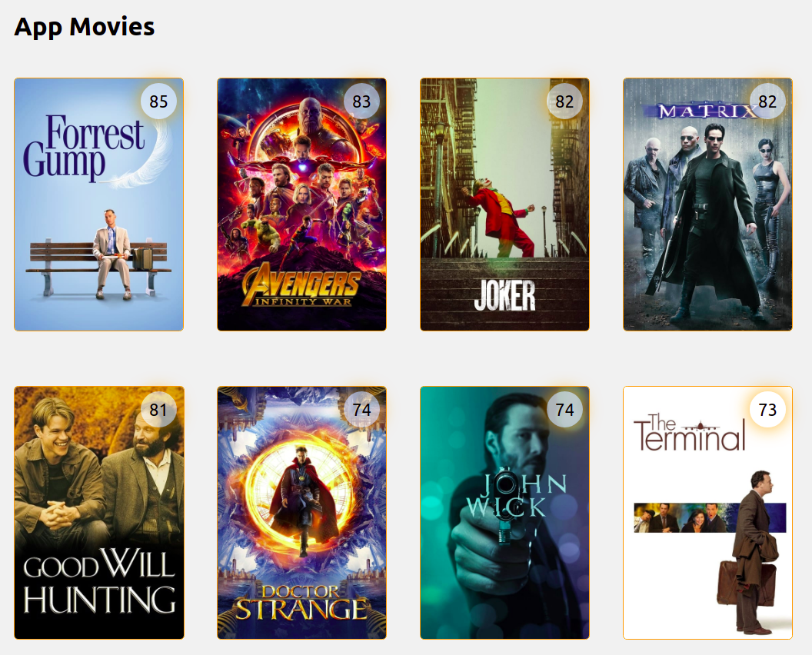
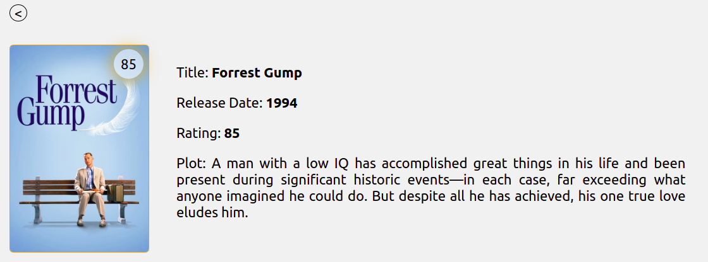

# MOVIE BACKEND

This project is the frontend service for Movie App.

##### The project structure is:

```bash
├── src
│   ├── components
│   ├── pages
│   ├── services
│   └── styles
└── package.json
```

## Quick start

- Navigate for this folder:

- Install dependences:

`yarn`

- Running it for dev environment:

`yarn start`

# Main Libraries

```
   "axios"
   "react"
   "react-dom"
   "react-router-dom"
   "styled-components"
   "typescript"
```


## Front End Views




